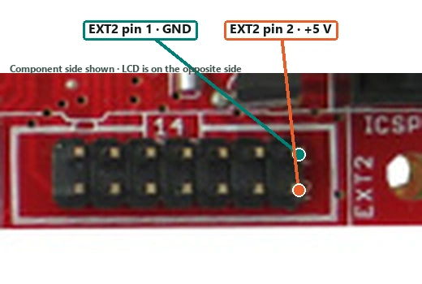

# Verified wiring

Power both systems down before changing connections. The logical UART names cross: one board's TX connects to the other board's RX.

## Raspberry Pi 5 to AVR-MT128 UART

The MT128 TTL header was verified by physical position in the project photograph. Viewed in that orientation, its contacts are left to right:

| Position | Signal | Conductor | Destination |
| --- | --- | --- | --- |
| Left | `+5V` | Red | Not connected |
| Second | `GND` | Green | Pi physical pin 6, GND |
| Third | `RXD1 / PD2` | Blue | Pi physical pin 8, GPIO14/TX |
| Right | `TXD1 / PD3` | Yellow | Divider input, then Pi physical pin 10, GPIO15/RX |

Do not infer contact order from logical pin numbering. Use the physical positions and labels above.

## MT128 TX level divider

The AVR-MT128 transmits approximately 5 V logic and the Pi GPIO is 3.3 V-only. Fit this divider in the yellow TX conductor:

```text
MT128 TXD1 (yellow) ---- 1 kOhm ----+---- Pi pin 10 RX
                                    |
                                  2 kOhm
                                    |
GND (green) ------------------------+---- Pi pin 6 GND
```

The divider output is approximately:

$$
V_{out}=5\text{ V}\frac{2\text{ kOhm}}{1\text{ kOhm}+2\text{ kOhm}}\approx3.33\text{ V}
$$

Pi TX is 3.3 V and was accepted directly by the MT128 RX input, so the blue Pi-to-MT128 path needs no divider.

## Hall switch

The active firmware reads the KY-024 digital output at `PD5`, exposed as AVR-MT128 `EXT1` pin 12. Use these exact board connections:

| Hall terminal | AVR-MT128 connection |
| --- | --- |
| `G` | `EXT2` pin 1, GND |
| `+` | `EXT2` pin 2, +5 V |
| `D0` | `EXT1` pin 12, `PD5 / XCK1` |
| `A0` | Not connected |

To locate the power contacts, view the MT128 component side with the `EXT2` label and ICSP header on the right. On the EXT2 pair nearest ICSP, the upper contact is pin 1 GND and the lower contact is pin 2 +5 V.



The tested module behaved as a digital A3144-style switch. Do not use the older `ADC0/PF0` wiring with the active controller firmware.

## Power domains

- Power the AVR-MT128 from its own suitable 12 VDC supply.
- Power the Raspberry Pi through its normal USB-C supply.
- Connect grounds through the green UART ground conductor.
- Leave the MT128 TTL `+5V` contact disconnected.
- The Olimex ISP programmer does not power the MT128 target.

## Safe bring-up order

1. With power off, connect the Hall switch and shared UART ground.
2. Test Pi TX to MT128 RX using only the blue conductor.
3. Disconnect blue and test MT128 TX to Pi RX using only the yellow conductor and divider.
4. Power down and connect both signal directions.
5. Confirm command and status traffic before connecting the relay-controlled piano circuit.